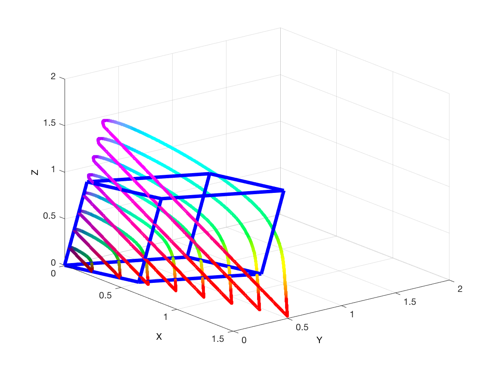
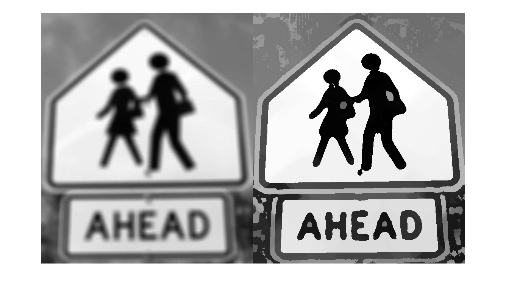
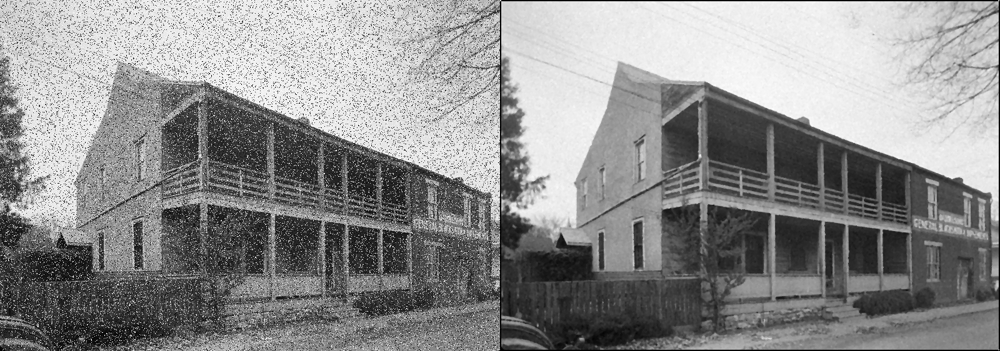
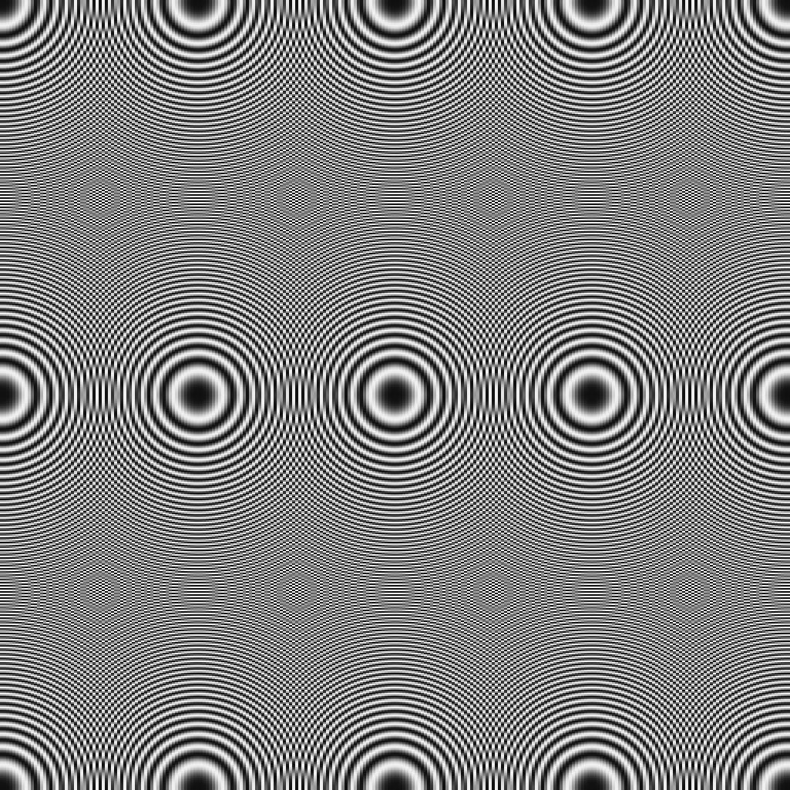
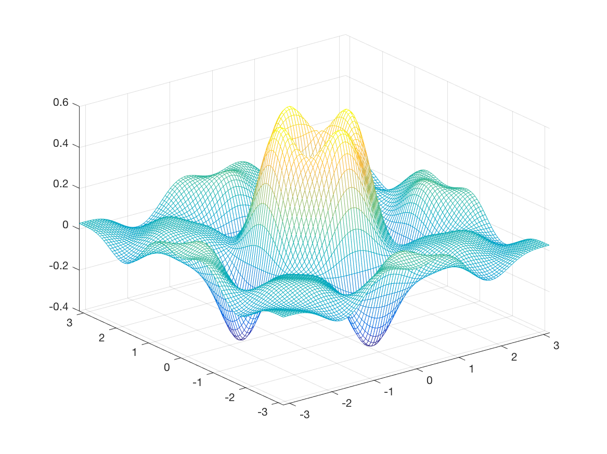
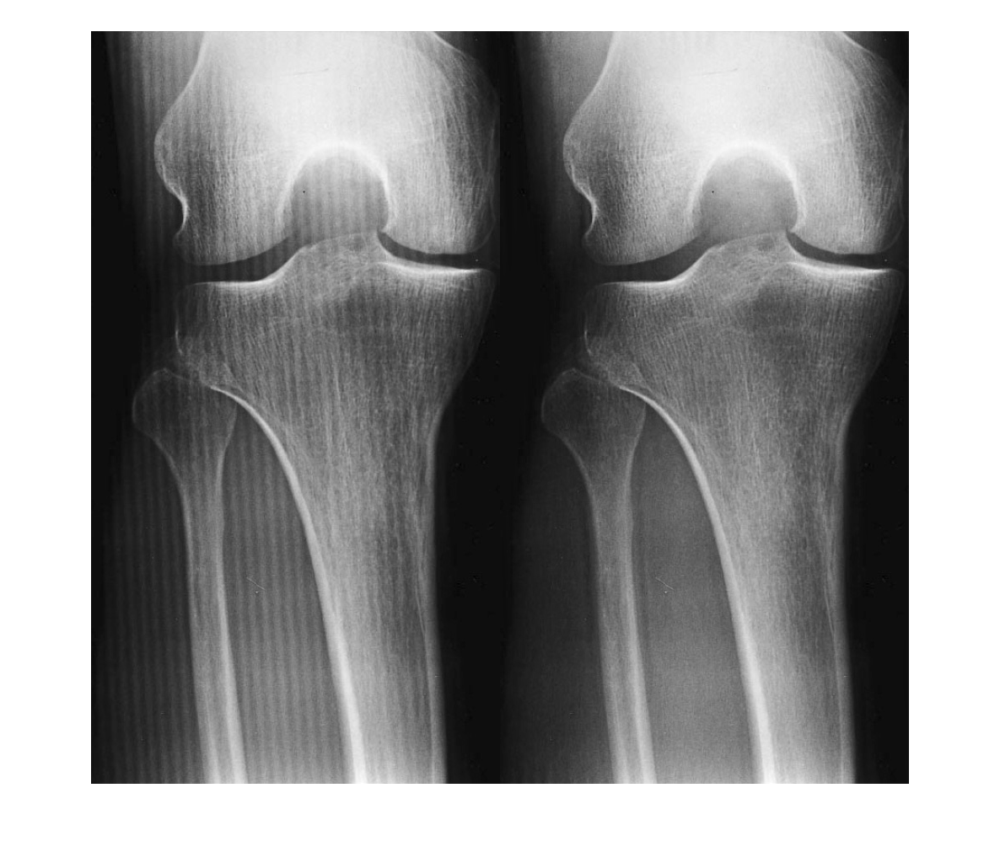
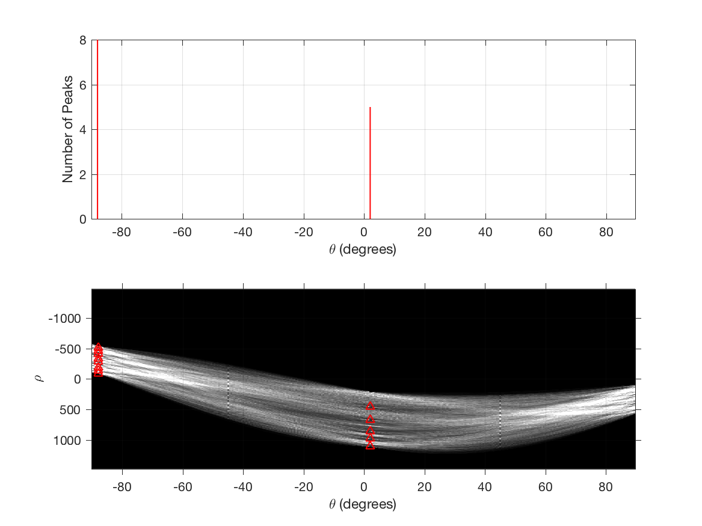
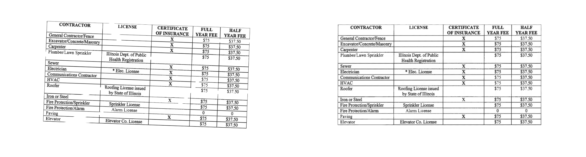
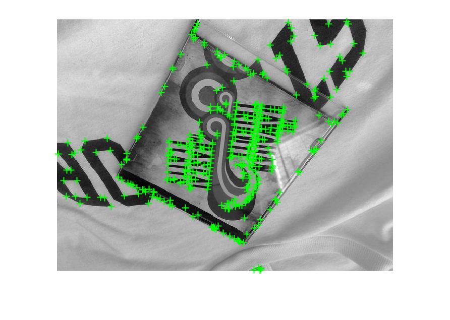
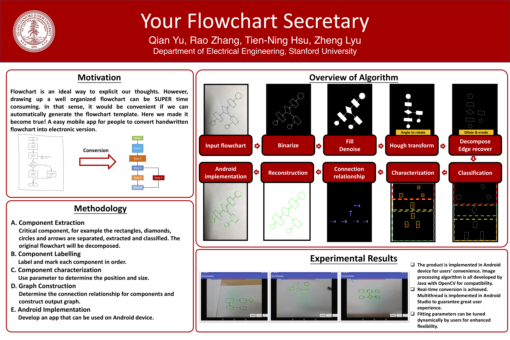

# EE368
### Stanford EE368 Digital Image Processing

### Course Assignments

__Color Space__

__Sharpness Enhancement__

__Weighted De-noise__

__Zoneplate__

__Difference-of-Boxes Filter__

__Moire Pattern Suppression__

__Document Image Restoration__

__Feature  Detection__

### Final Project

- Report: [__PDF__](project/report/EE368_FinalReport.pdf)

__Abstract__:  Often when we are prototyping new ideas, a flowchart will be an ideal way to explicit our thoughts. However, it could be super time consuming to draw up a well-organized one onto our documentation files or presentation. In that sense, it would be really convenient if we can automatically generate the flowchart template with proper order informed from hand drawing chart. Here we developed an Android implemented application that can generate electronic version when scanning the flowchart. The application can be applied in many settings from discussion and notes in daily use to formal meetings in company or education institution. In addition, this product will be implemented in Android device for users convenience.

- Poster: [__PDF__](project/poster/EE368_Poster_Final.pdf)
  